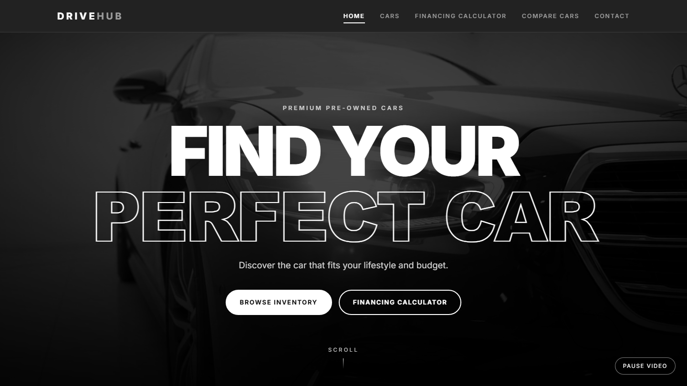

# Drive Hub - Car Dealership Website

A responsive, black-and-white car dealership website built with **HTML, CSS and vanilla JavaScript** as a university project.

**Live demo:** https://fatimaibrahim5.github.io/drive-hub/



## Features

- **Home page** - full-screen video hero, animated featured cars that flip from front to rear, "Why choose us", services, customer reviews and a financing section.
- **Cars (inventory)** - 8 cars with front, rear and interior galleries, full specifications, brand filters and sorting.
- **Financing calculator** - calculates the monthly payment from the car price, down payment, loan term and interest rate.
- **Compare cars** - compare up to 3 cars on the details the user chooses, with the best value highlighted.
- **Contact page** - contact details and a form with validation (front-end only).
- Responsive design for desktop, tablet and mobile.

## Tech stack

- HTML5
- CSS3 (custom properties, grid, flexbox, 3D transforms, animations)
- JavaScript (ES5, no frameworks or libraries)

## Project structure

```
index.html        Home page
inventory.html    Cars and details
finCal.html       Financing calculator
compare.html      Compare cars
contact.html      Contact page
css/style.css     All styling
js/data.js        Car data (edit cars here)
js/*.js           Page scripts
image/            Car photos
video/            Hero video
```

## Run locally

Open `index.html` in a browser, or run a local server inside the folder:

```
python -m http.server
```

Then visit `http://localhost:8000`.

## Notes

This is a portfolio project. All cars, prices, reviews, phone number and email are fictional. Car photos are used for demonstration purposes only.
